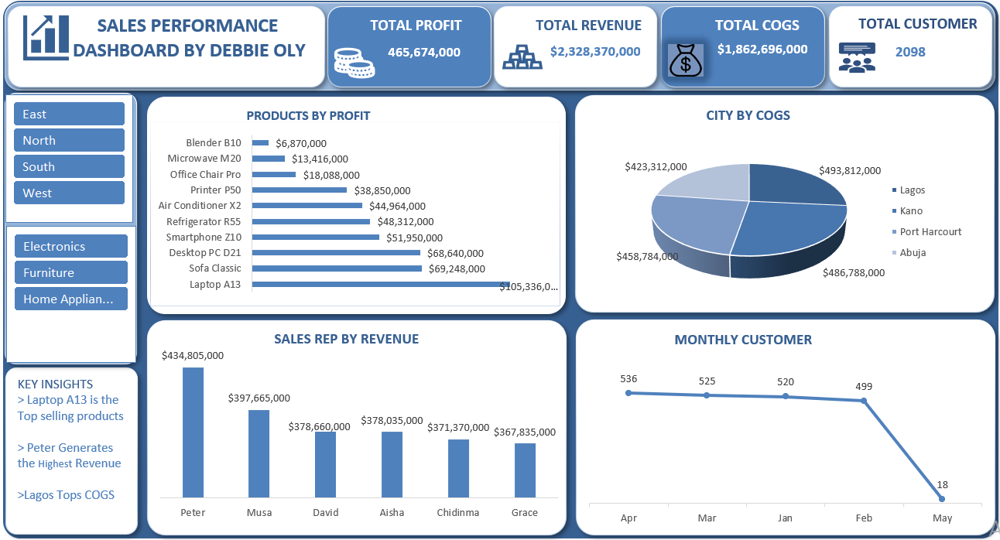
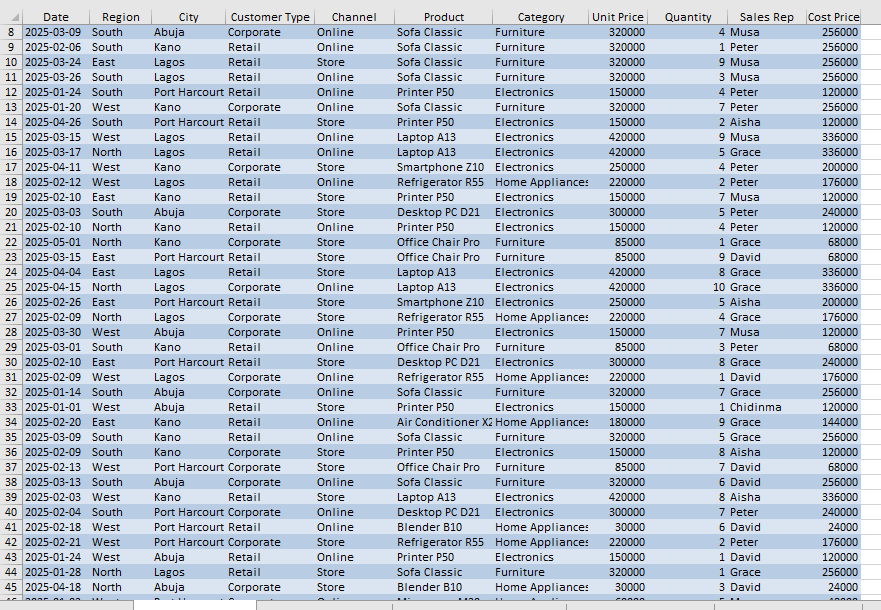
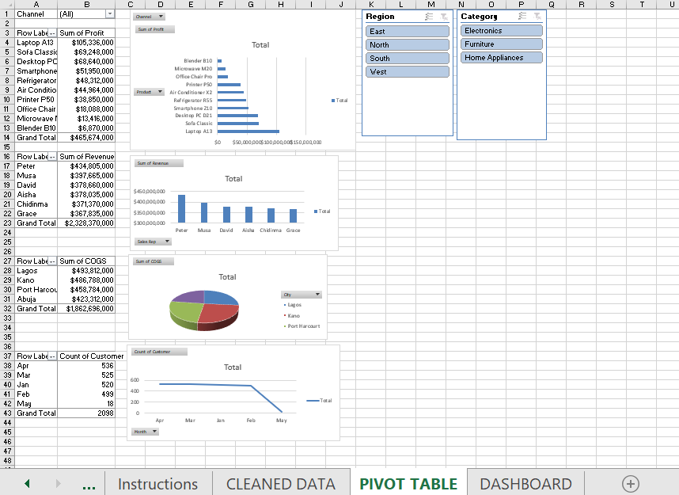

# 📊 Sales Performance Dashboard — Microsoft Excel


---

## 📋 Table of Contents

- [Project Overview](https://github.com/Deborah-Eke/Sales-Analysis/blob/main/README.md#-project-overview)
- [Dashboard Preview](https://github.com/Deborah-Eke/Sales-Analysis/blob/main/README.md#-dashboard-preview)
- [Workbook Structure](https://github.com/Deborah-Eke/Sales-Analysis/blob/main/README.md#-workbook-structure)
- [Dataset Information](https://github.com/Deborah-Eke/Sales-Analysis/blob/main/README.md#-dataset-information)
- [Project Objectives](https://github.com/Deborah-Eke/Sales-Analysis/blob/main/README.md#-project-objectives)
- [Tools & Techniques](https://github.com/Deborah-Eke/Sales-Analysis/blob/main/README.md#-tools--techniques)
- [Data Preparation Process](https://github.com/Deborah-Eke/Sales-Analysis/blob/main/README.md#-data-preparation-process)
- [PivotTable Analysis](https://github.com/Deborah-Eke/Sales-Analysis/blob/main/README.md#-pivottable-analysis)
- [Dashboard Visuals](https://github.com/Deborah-Eke/Sales-Analysis/blob/main/README.md#-dashboard-visuals)
- [Key Metrics Summary](https://github.com/Deborah-Eke/Sales-Analysis/blob/main/README.md#-key-metrics-summary)
- [Key Insights](https://github.com/Deborah-Eke/Sales-Analysis/blob/main/README.md#-key-insights)
- [Business Recommendations](https://github.com/Deborah-Eke/Sales-Analysis/blob/main/README.md#-business-recommendations)
- [Project Workflow](https://github.com/Deborah-Eke/Sales-Analysis/blob/main/README.md#-project-workflow)
- [Folder Structure](https://github.com/Deborah-Eke/Sales-Analysis/blob/main/README.md#-folder-structure)
- [Skills Demonstrated](https://github.com/Deborah-Eke/Sales-Analysis/blob/main/README.md#-skills-demonstrated)
- [Results Summary](https://github.com/Deborah-Eke/Sales-Analysis/blob/main/README.md#-results-summary)
- [Conclusion](#conclusion)

---

## 📌 Project Overview

This project delivers an end-to-end **Sales Performance Dashboard**
built entirely in Microsoft Excel — from raw transactional data
through formula-based cleaning, PivotTable analysis, and a fully
interactive dashboard with region and category slicers.

The dataset covers 2,098 sales transactions across a Nigerian
multi-region retail business operating in 4 cities, 4 regions,
and 3 product categories between January and May 2025.

### The Business Problem

A retail business selling across Lagos, Kano, Port Harcourt, and
Abuja needed a single view of sales performance — which products
are most profitable, which sales representatives generate the most
revenue, which cities carry the highest cost burden, and how
customer volume is trending month by month. The raw data contained
only the transaction inputs (unit price, quantity, cost price) with
no calculated measures, making it impossible to answer these
questions without additional preparation.

### Why This Analysis Matters

With ₦2.33B in total revenue and a 20% profit margin, the business
is profitable — but the monthly customer trend reveals a critical
signal that revenue figures alone cannot show. Understanding where
profit is made and where it is at risk requires connecting product,
geography, sales rep, and time dimensions in a single analytical
view, which the dashboard provides.

### Objective

To transform 2,098 raw sales records into a clean, formula-driven
analytical dataset, build PivotTables covering profitability,
city-level COGS, sales rep performance, and customer trend, and
deliver an interactive Excel dashboard with slicers for Region and
Product Category.

---

## 📊 Dashboard Preview



---

## 🗂 Workbook Structure

The Excel workbook contains five sheets, each serving a specific
purpose in the analytics workflow:

| Sheet | Purpose |
|---|---|
| **Sales Data** | Original raw dataset — 2,098 rows, 11 columns, untouched |
| **Instructions** | Project brief describing the cleaning and KPI tasks |
| **CLEANED DATA** | Prepared dataset with 5 calculated columns added using Excel formulas |
| **PIVOT TABLE** | All PivotTables and PivotCharts used for analysis |
| **DASHBOARD** | Final interactive dashboard with slicers, KPI cards, and charts |

---

## 🗃 Dataset Information

### Raw Data (`Sales Data` sheet)

| Attribute | Detail |
|---|---|
| **Rows** | 2,098 transactions |
| **Columns** | 11 |
| **Period** | January 2025 – May 2025 |
| **Missing Values** | 0 |
| **Duplicate Rows** | 0 |

### Raw Columns

| Column | Type | Description |
|---|---|---|
| Date | Date | Transaction date |
| Region | Text | East / North / South / West |
| City | Text | Abuja / Kano / Lagos / Port Harcourt |
| Customer Type | Text | Corporate / Retail |
| Channel | Text | Online / Store |
| Product | Text | 10 product names |
| Category | Text | Electronics / Furniture / Home Appliances |
| Unit Price | Number | Selling price per unit (₦) |
| Quantity | Number | Units sold |
| Sales Rep | Text | 6 sales representatives |
| Cost Price | Number | Cost per unit (₦) |

### Columns Added During Preparation

| New Column | Formula Logic | Purpose |
|---|---|---|
| **Month** | Extracted from Date | Enables monthly grouping in PivotTables |
| **Revenue** | Unit Price × Quantity | Total selling value per transaction |
| **COGS** | Cost Price × Quantity | Total cost of goods sold per transaction |
| **Profit** | Revenue − COGS | Gross profit per transaction |
| **Customer** | Count of transactions | Customer volume metric |

---

## 🎯 Project Objectives

- Calculate the four core KPIs: Revenue, COGS, Profit, and Customer count
- Rank all 10 products by total profit to identify top and bottom performers
- Compare all 6 sales representatives by total revenue generated
- Show how cost of goods sold is distributed across the 4 cities
- Track monthly customer volume to identify trends and seasonal patterns
- Enable interactive filtering by Region and Product Category
- Deliver a single-page dashboard suitable for management reporting

---

## 🛠 Tools & Techniques

| Tool / Technique | Purpose |
|---|---|
| **Microsoft Excel** | Complete project — cleaning, analysis, and dashboard |
| **Excel Formulas** | Calculated columns (Revenue, COGS, Profit, Month) |
| **PivotTables** | Aggregation by product, sales rep, city, and month |
| **PivotCharts** | Bar chart, column chart, pie chart, and line chart |
| **Slicers** | Interactive Region and Category filters |
| **KPI Cards** | Headline metrics (Total Profit, Revenue, COGS, Customer) |
| **Dashboard Design** | Formatted layout with blue corporate theme |

---

## 🧹 Data Preparation Process

The raw `Sales Data` sheet contained only the base transaction
columns — no calculated measures existed. All preparation was
performed using Excel formulas in the `CLEANED DATA` sheet,
keeping the original data untouched as a reference layer.

### Cleaned Data Sheet


### Step 1 — Added the Month column

A `Month` column was extracted from the `Date` column using an
Excel formula to return the abbreviated month name (Jan, Feb,
Mar, Apr, May). This column was needed so PivotTables could
group customer counts and revenue by month in the correct
chronological order.

### Step 2 — Calculated Revenue

`Revenue = Unit Price × Quantity`

Applied across all 2,098 rows. This formula converts the per-unit
selling price into the actual transaction value. All 2,098 Revenue
values were verified to match Unit Price × Quantity exactly —
zero mismatches.

### Step 3 — Calculated COGS

`COGS = Cost Price × Quantity`

Applied across all 2,098 rows. Cost Price represents the per-unit
procurement cost; multiplying by Quantity gives the total cost
burden for each transaction. All 2,098 COGS values were verified
— zero mismatches.

### Step 4 — Calculated Profit

`Profit = Revenue − COGS`

Applied across all 2,098 rows. This gives the gross profit
contribution of each transaction. All 2,098 Profit values were
verified against Revenue − COGS — zero mismatches.

### Step 5 — Added Customer column

A `Customer` column was added to support the customer count KPI
used in the dashboard headline card (2,098 total customers,
representing one transaction per customer in this dataset).

### Data Quality Confirmation

The raw `Sales Data` sheet was clean at the point of receipt —
zero missing values and zero duplicate rows across all 11 columns.
The preparation work therefore focused entirely on enriching the
dataset with calculated measures rather than correcting errors.

---

## 📊 PivotTable Analysis

Four PivotTables were built in the `PIVOT TABLE` sheet, each
answering a specific business question.
### PivotTable screenshot


### PivotTable 1 — Products by Profit

**Question:** Which products generate the most and least profit?

Rows: Product | Values: Sum of Profit | Sorted: Descending

This table ranks all 10 products from the most to least
profitable, revealing a significant gap between the top and
bottom performers. Laptop A13 at ₦105,336,000 generates
over 15 times the profit of Blender B10 at ₦6,870,000.

### PivotTable 2 — Sales Rep by Revenue

**Question:** Which sales representatives generate the most revenue?

Rows: Sales Rep | Values: Sum of Revenue | Sorted: Descending

This table ranks all 6 sales representatives by total revenue,
showing Peter leading the team at ₦434,805,000 and Grace at
the bottom at ₦367,835,000 — a relatively narrow ₦67M spread
indicating a consistent, well-balanced team.

### PivotTable 3 — City by COGS

**Question:** Which cities carry the highest cost of goods sold?

Rows: City | Values: Sum of COGS | Sorted: Descending

This table shows the total procurement cost attributable to each
city, with Lagos carrying the largest share at ₦493,812,000.
The four-city COGS total matches the overall COGS KPI of
₦1,862,696,000 exactly, confirming the formula integrity.

### PivotTable 4 — Monthly Customer Count

**Question:** How is customer volume trending month by month?

Rows: Month | Values: Count of Customer | Sorted: By month

This table tracks how many transactions occurred each month,
revealing a consistent pattern in the April–January–February
range followed by a dramatic drop in May to just 18 transactions —
the most important finding in the entire dataset.

---

## 📈 Dashboard Visuals

The `DASHBOARD` sheet presents all findings in a single interactive
page with four charts and four KPI headline cards, controlled by
Region and Category slicers.

### KPI Cards (top row)

Four headline cards display the overall business totals at a glance:

| Card | Value |
|---|---|
| Total Profit | ₦465,674,000 |
| Total Revenue | ₦2,328,370,000 |
| Total COGS | ₦1,862,696,000 |
| Total Customers | 2,098 |

### Products by Profit — Horizontal Bar Chart

A horizontal bar chart ranks all 10 products from Laptop A13
(₦105,336,000) down to Blender B10 (₦6,870,000). The horizontal
layout was chosen because it accommodates full product names
without truncation and makes the rank order immediately readable.
The chart is connected to the Category slicer, so selecting
Electronics, Furniture, or Home Appliances filters it to show
only that category's products.

### City by COGS — 3D Pie Chart

A pie chart shows how total COGS splits across the four cities.
A pie chart is appropriate here because the question is about
proportional share of a total (how much of the ₦1.86B COGS
belongs to each city), and four segments remain readable.
Lagos at ₦493,812,000 holds the largest slice.

### Sales Rep by Revenue — Column Chart

A column chart compares all six sales representatives by total
revenue side by side. Columns were chosen over bars because the
six reps fit cleanly on a horizontal axis without label
crowding. Peter's ₦434,805,000 bar is clearly the tallest,
but the relatively uniform heights across all six reps tell
a story of team-wide consistency.

### Monthly Customer — Line Chart

A line chart tracks customer count across the five months (Apr,
Mar, Jan, Feb, May). A line chart is the clearest way to show
change over time and makes the dramatic May drop — from 499
in February to just 18 in May — immediately visible as the
steepest decline on the chart. This is deliberately the most
prominent trend visual on the dashboard.

### Slicers

Two slicers on the left panel filter the entire dashboard
simultaneously — Region (East, North, South, West) and
Category (Electronics, Furniture, Home Appliances). Selecting
any combination updates all four charts and the KPI cards
together, enabling region- and category-level performance
analysis without rebuilding any PivotTable.

---

## 📈 Key Metrics Summary

| Metric | Value |
|---|---|
| Total Revenue | **₦2,328,370,000** |
| Total COGS | **₦1,862,696,000** |
| Total Profit | **₦465,674,000** |
| Profit Margin | **20%** |
| Total Customers | **2,098** |
| Top Product by Profit | **Laptop A13 — ₦105,336,000** |
| Second Product by Profit | **Sofa Classic — ₦69,248,000** |
| Lowest Product by Profit | **Blender B10 — ₦6,870,000** |
| Top Sales Rep by Revenue | **Peter — ₦434,805,000** |
| Lowest Sales Rep by Revenue | **Grace — ₦367,835,000** |
| Highest COGS City | **Lagos — ₦493,812,000** |
| Lowest COGS City | **Abuja — ₦423,312,000** |
| Busiest Month | **April — 536 customers** |
| Quietest Month | **May — 18 customers** |

---

## 💡 Key Insights

**1. Laptop A13 is the clear profit leader at ₦105,336,000.**
It generates 52% more profit than the second-ranked product
(Sofa Classic at ₦69,248,000) and over 15 times the profit
of the lowest-ranked product (Blender B10 at ₦6,870,000).
The business should ensure Laptop A13 is consistently in
stock and prioritised in marketing activity.

**2. The bottom three products contribute less than 9% of total profit.**
Blender B10 (₦6.9M), Microwave M20 (₦13.4M), and Office
Chair Pro (₦18.1M) together contribute ₦38.4M — less than
the margin from a single strong Laptop A13 month. Their
pricing or sourcing costs deserve review.

**3. The sales team performs within a tight ₦67M revenue band.**
Peter leads at ₦434.8M and Grace is at ₦367.8M — a 15%
gap between first and last. This is a healthy spread that
indicates consistent team-wide performance rather than
dependence on any single representative.

**4. Lagos carries the highest COGS at ₦493.8M.**
Lagos generates the most sales volume but also the highest
cost burden. Whether this reflects higher-value products
being sold in Lagos or higher unit volumes needs further
investigation at the product-city level.

**5. COGS consumes 80% of every naira earned.**
With ₦1.86B in COGS against ₦2.33B in revenue, the gross
margin is 20%. This is a thin margin for multi-region retail,
meaning supplier cost negotiations would have a significant
positive impact even with a modest reduction in cost price.

**6. The May customer drop to 18 is the most urgent business signal.**
April had 536 customers, March had 525, January had 520, and
February had 499. May collapsed to just 18. This is not a
seasonal pattern — it is a sudden operational or data
anomaly that requires immediate investigation. Either the
business experienced a severe disruption in May or the
May data is incomplete.

**7. Customer volume was stable from January to April.**
The 37-transaction drop from April (536) to February (499)
over four months represents a gentle, manageable decline.
The business was not in structural trouble before May —
which makes the May cliff even more unusual and important
to investigate.

**8. Electronics, Furniture, and Home Appliances serve different
margin profiles.**
Using the Category slicer reveals how differently the three
categories perform by region. This regional-category
interaction is not visible in the overall totals and is
one of the most valuable uses of the interactive slicer.

---

## 📢 Business Recommendations

**1. Investigate the May customer drop immediately.**
A fall from 499 customers in February to 18 in May is too
severe to attribute to seasonal variation. The business
must determine whether this reflects a data capture gap,
a supply disruption, a systems issue, or a genuine
loss of customers — before the next operating period begins.

**2. Prioritise Laptop A13 in inventory and marketing planning.**
As the single highest-profit product at ₦105.3M, any
stock-out of Laptop A13 directly reduces the business's
profitability. Safety stock levels and supplier lead times
for this product should be reviewed.

**3. Review the pricing or sourcing of the bottom three products.**
Blender B10, Microwave M20, and Office Chair Pro collectively
contribute less than 9% of total profit. The business should
assess whether increasing their prices, renegotiating
supplier costs, or replacing them with higher-margin
alternatives would improve overall profitability.

**4. Target Lagos for cost reduction negotiations.**
As the highest-COGS city, Lagos is where cost management
will have the most impact. If COGS is driven by high-value
product mix rather than unit volume, ensuring the right
products are stocked in Lagos while reviewing their cost
prices with suppliers is the right starting point.

**5. Study what Peter does differently and share it with the team.**
Peter's revenue lead is meaningful but not dominant. Rather
than simply pushing low performers, the business should
identify the specific behaviours, products, and customer
segments where Peter excels and build those practices into
team-wide training.

---

## 🔄 Project Workflow

```
Raw Sales Data (Sales Data sheet — 2,098 rows, 11 columns)
            │
            ▼
  Data Preparation (CLEANED DATA sheet)
  ├── Added Month column (extracted from Date)
  ├── Calculated Revenue = Unit Price × Quantity
  ├── Calculated COGS = Cost Price × Quantity
  ├── Calculated Profit = Revenue − COGS
  └── Added Customer column for headcount KPI
            │
            ▼
  PivotTable Analysis (PIVOT TABLE sheet)
  ├── Products by Profit (ranked descending)
  ├── Sales Rep by Revenue (ranked descending)
  ├── City by COGS (ranked descending)
  └── Monthly Customer Count (Jan – May)
            │
            ▼
  Dashboard (DASHBOARD sheet)
  ├── 4 KPI headline cards
  ├── Horizontal bar chart — Products by Profit
  ├── Pie chart — City by COGS
  ├── Column chart — Sales Rep by Revenue
  ├── Line chart — Monthly Customer trend
  └── Region and Category slicers
            │
            ▼
  Key Insights & Business Recommendations
```

---

## 📁 Folder Structure

```
Sales-Performance-Excel-Dashboard/
│
├── 📂 Workbook/
│   └── Eke_Deborah_EXCEL_Project.xlsx   ← Full workbook (all 5 sheets)
│
├── 📂 Images/
│   ├── excel_dashboard.png              ← Dashboard screenshot
│   ├── pivot_table.png                  ← PivotTable sheet screenshot
│   ├── cleaned_data.png                 ← Cleaned data sheet screenshot
│   ├── sum_of_revenue.png               ← Revenue PivotTable screenshot
│   └── cost_of_good_sold.png            ← COGS PivotTable screenshot
│
└── README.md
```

---

## 🧠 Skills Demonstrated

| Skill | Evidence |
|---|---|
| **Excel Formulas** | Revenue, COGS, Profit, Month — calculated across 2,098 rows |
| **Formula Accuracy** | All three calculated columns verified — zero mismatches |
| **PivotTables** | Four PivotTables covering product, rep, city, and time dimensions |
| **PivotCharts** | Bar, column, pie, and line charts built from PivotTable data |
| **Slicers** | Region and Category slicers connected to all dashboard visuals |
| **Dashboard Design** | Single-page layout with KPI cards and consistent blue theme |
| **Data Storytelling** | Monthly customer trend and product profit ranking framed as business questions |
| **Business Analysis** | Recommendations tied to specific findings from the data |
| **Workbook Organisation** | Five-sheet structure separating raw data, preparation, analysis, and output |

---

## 📝 Results Summary

This project transforms 2,098 raw retail sales transactions into
an interactive Excel dashboard that gives management a complete
view of product profitability, sales team performance, city-level
cost distribution, and customer volume trend. Using Excel formulas
to calculate Revenue, COGS, Profit, and Month — then building four
PivotTables and a fully slicer-connected dashboard — the project
demonstrates end-to-end Excel analytical capability without any
external tools. The most important finding — a May customer count
of 18 against a prior-month average of over 500 — was only
visible because the monthly trend was visualised as a line chart
rather than a summary total, showing the power of choosing the
right visual for each business question.

---

## ✅ Conclusion

This Excel project shows that rigorous, actionable analysis does
not require specialised software. Starting from a clean
transactional dataset, every KPI was calculated with formulas,
every insight was surfaced through PivotTables, and every
finding was made navigable through dashboard slicers. The result
is a tool that a sales manager can use on any device with Excel
installed — filtering by region and category, reading the key
metrics at a glance, and acting on the findings the same day.

---

## 👤 Author

**Eke Deborah (Debbie Oly)** — Data Analyst | Excel · Power BI · SQL · Python

- 🔗 [LinkedIn](https://www.linkedin.com/in/your-linkedin)
- 📧 your.email@gmail.com
- 🐙 [GitHub](https://github.com/your-username)

---

*Dataset covers simulated Nigerian retail sales transactions
from January to May 2025.*

